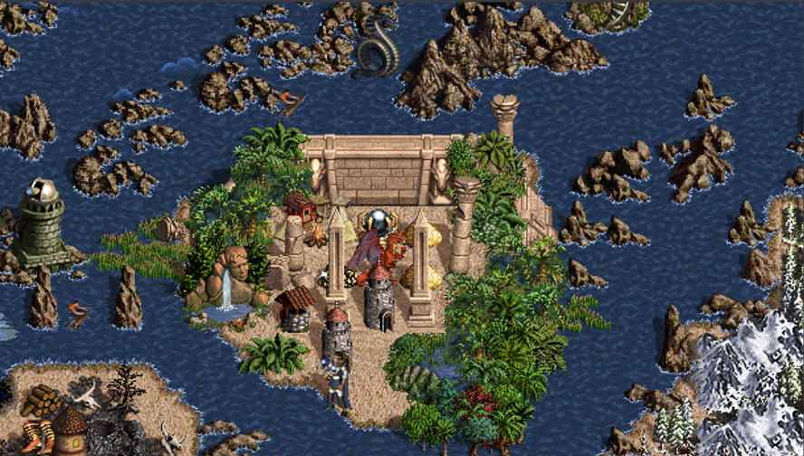

# Heroes3: Black Isle - Horn of the Abyss

Welcome to the official repository for the **Heroes3: Black Isle** scenario, designed for the **Horn of the Abyss** expansion. This map brings new adventures and challenges with the addition of the Factory faction.

## Overview

Heroes of Might and Magic III (Heroes3) is a beloved strategy game, and the Horn of the Abyss (HotA) expansion has revitalized the community with new content. Black Isle is a custom map designed to leverage these new features, providing an immersive and challenging experience.

## Features

- **Three Playable Factions**: Including the new Factory faction.
- **Large Map Size**: Size L with basement, supporting up to 8 players (3 human and 5 computer).
- **Unique Quests and Challenges**: Tailored quests for each faction.

## Installation

To play the Heroes3: Black Isle map, follow these steps:
1. Download the map from [GitHub](https://github.com/gr0mph/Heroes3-BlackIsle).
2. Locate the file `[HotA] Black Isle.h3m` in the repository.
3. Download the file (click on "Download raw file").
4. Place the file into your Heroes3 maps folder.

## Updates

We continually update the map based on community feedback to ensure the best gameplay experience. Recent updates include:
- Remove sanctuary
- Add dimension door spell
- Add finding the grail
- Add Dracon and Gelu
- Reduced creature spawn rates for opponents.
- Enhanced quest rewards.

## Contributing

Your contributions are welcome! Whether it's through feedback, suggestions, or code, we appreciate any help in making Heroes3: Black Isle even better.

## Support

Creating this map is a labor of love. If you enjoy playing it and would like to support future projects, donations are appreciated but not required.

To donate, simply send Solana to the wallet below (even 0.01 Sol helps). Thank you!

Wallet: **AYJ7Pc4zwfFheqYwyNik3n3qvQE2it9U6x9XireJcQ8c**

## Contact

For any questions, suggestions, or feedback, feel free to open an issue on GitHub or contact us directly.

Enjoy your adventures in **Heroes3: Black Isle - Horn of the Abyss**!
