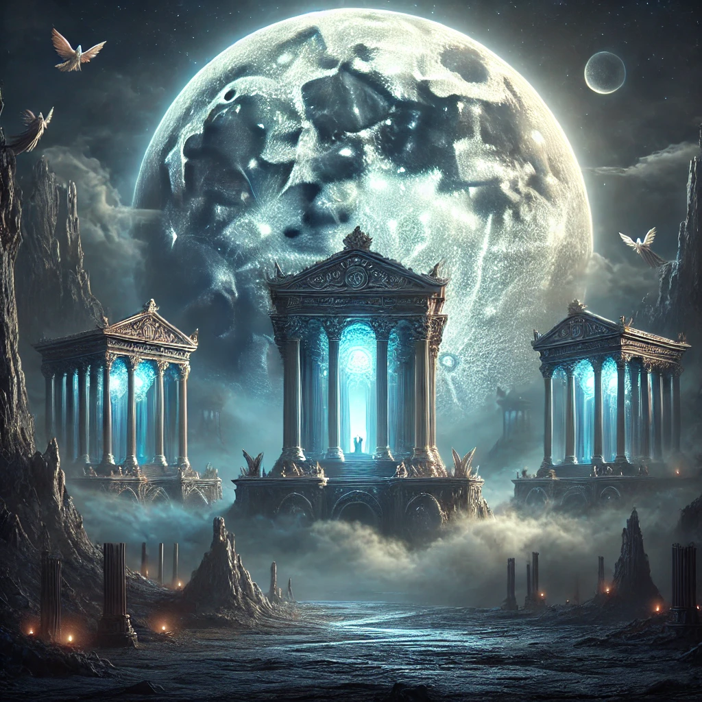
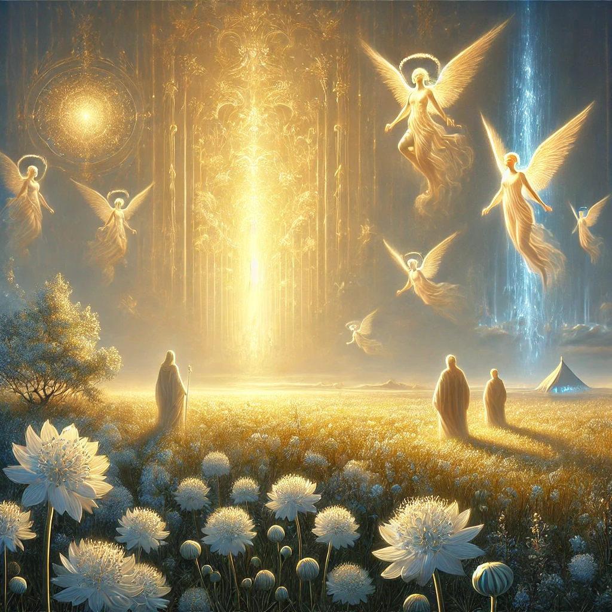
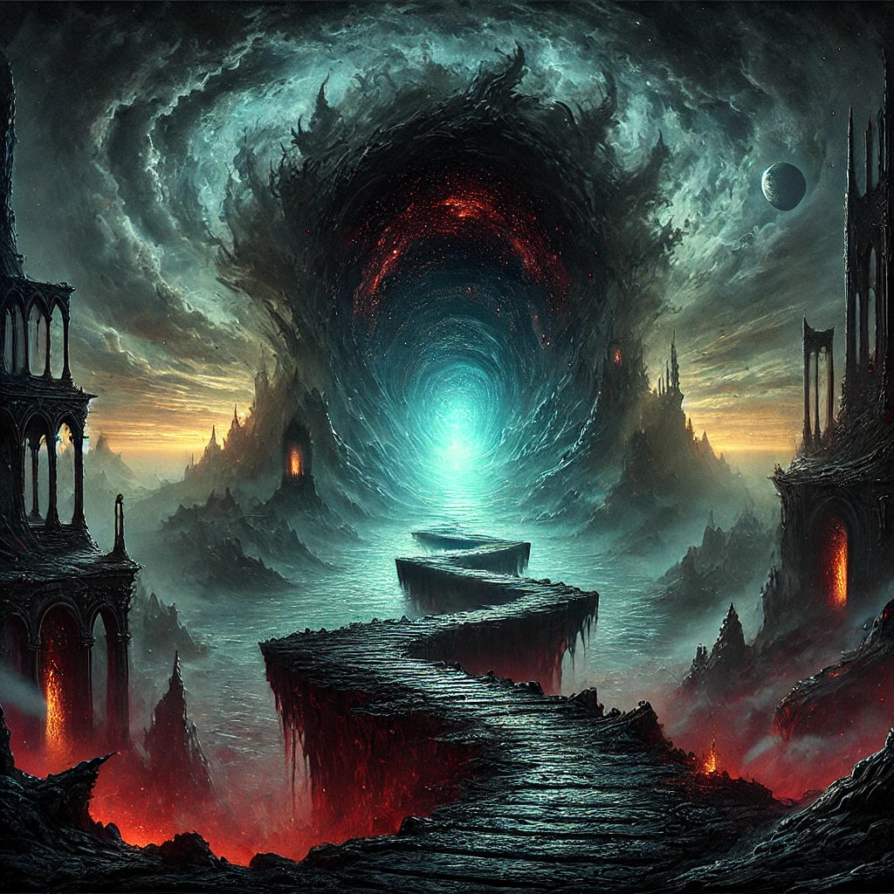
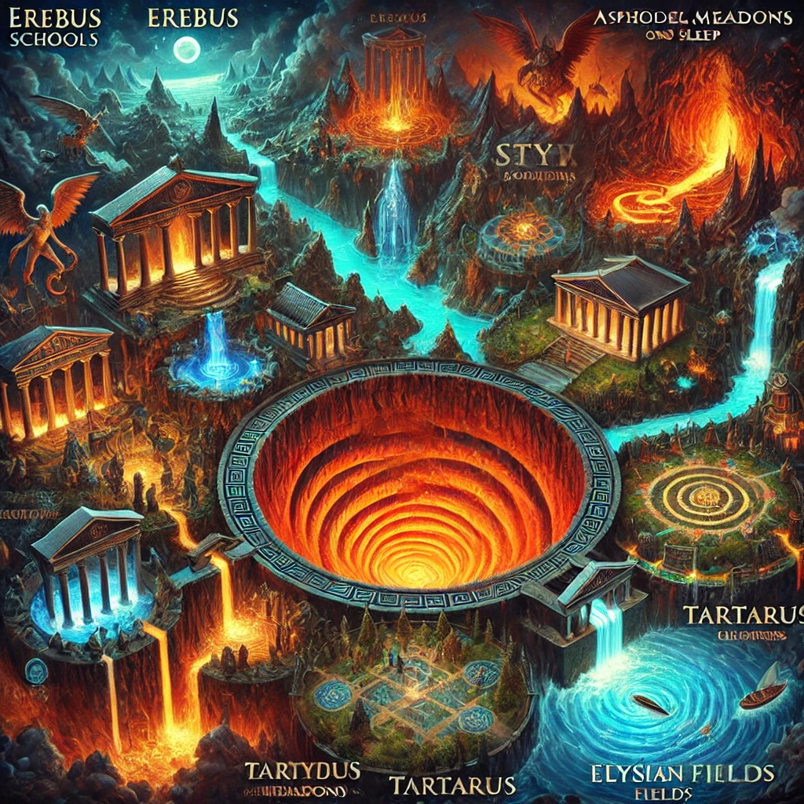
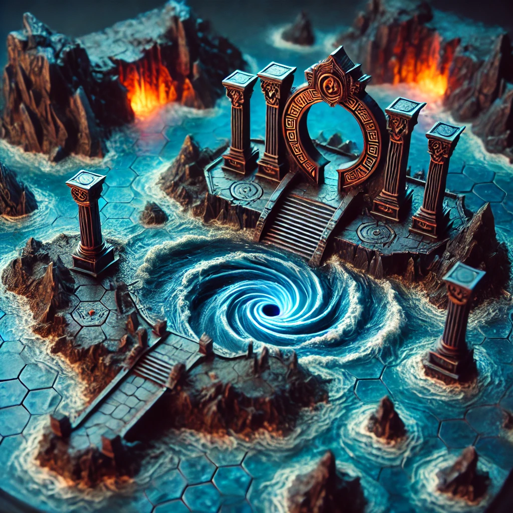
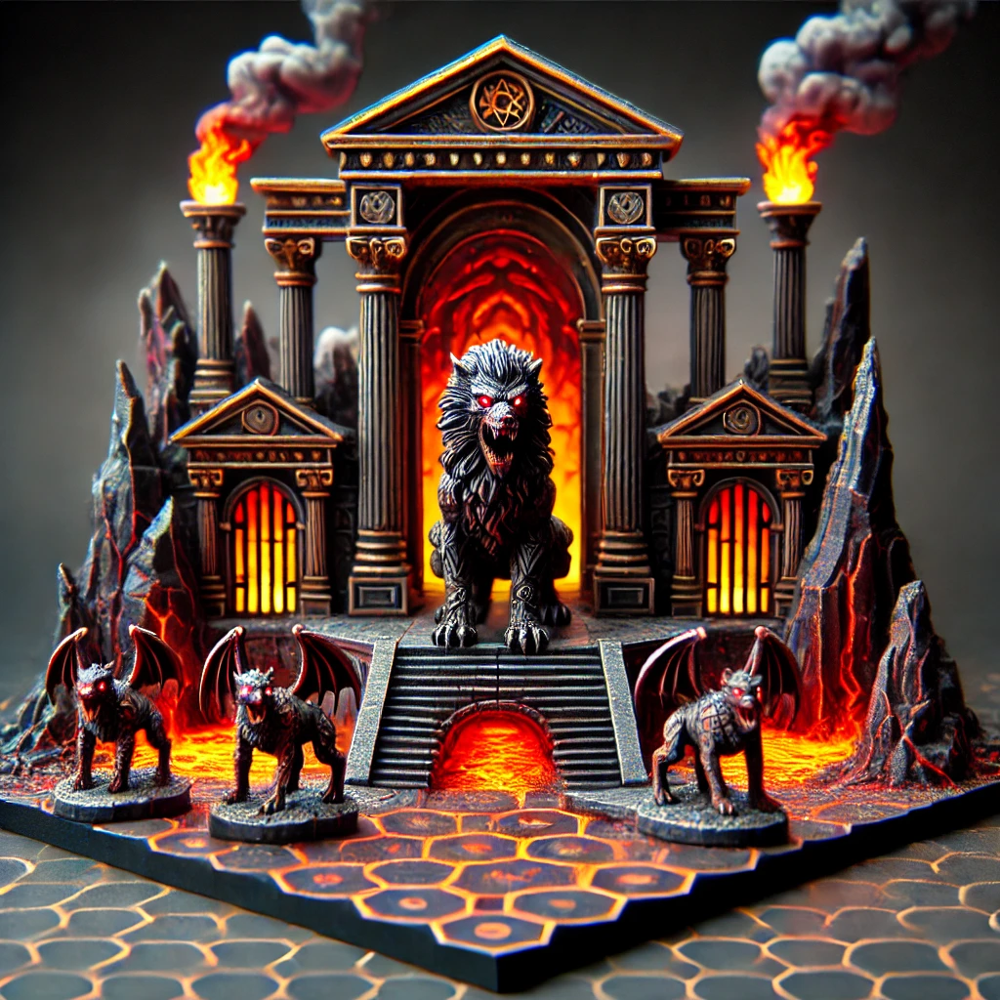

# Heroes3: Black Isle - Horn of the Abyss

## Greek Underworld

- Erebus – Journey into the Heart of Greek Darkness
- Discover Erebus, a mysterious region of the Greek underworld, where the palaces of Night, Dream and Sleep stand. This illustration is inspired by Greek mythology and is an integral part of the Black Isle v1.2.1 – Underground Greek map for the legendary game Heroes of Might and Magic III. Dive into this world of strategy, legends and fantasy art!

- The Asphodel Meadows – A Mythical Realm of Neutral Souls
- The Asphodel Meadows, a serene yet mysterious realm in Greek mythology, is where the souls of those who lived neither virtuous nor wicked lives wander for eternity. In this depiction, you can see the vast expanse of the meadows, dotted with asphodel flowers, symbolizing peace and neutrality. The hero can recruit wandering peasants, who might just be the key to unlocking greater destinies. This gateway leads to the Fields of Elysium, where angels and glory await, and to hidden secrets that shape the fate of Black Isle.

- Dive into this artistic vision inspired by Heroes of Might and Magic 3 and Greek mythology, blending strategy, exploration, and storytelling.

- The River Styx and the Tartarus Gates – Greek Underworld
- The River Styx, a mystical and ominous boundary of the Greek underworld, flows into the depths of Tartarus. Beyond its dark waters lies a realm of despair, where Titans and Giants remain imprisoned, each locked behind enchanted gates. At its heart stands the Crimson Tent, a symbol of ultimate confrontation, while Forsaken Palaces remind us of the infernal power lurking in the shadows.

- Journey carefully, for Tartarus is guarded by fiends and flames, and only the most determined heroes will uncover its treasures and secrets.

- Gallery

